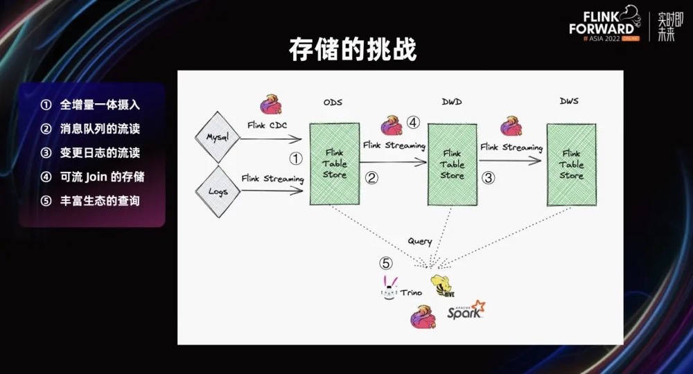
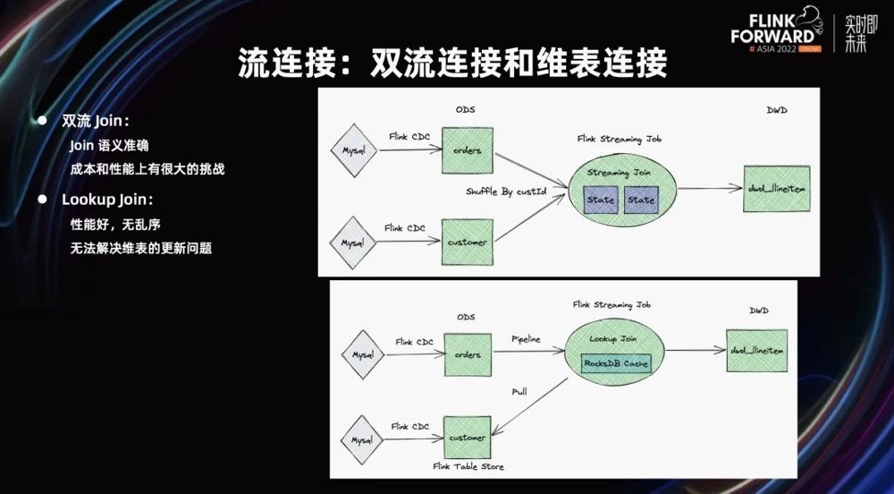
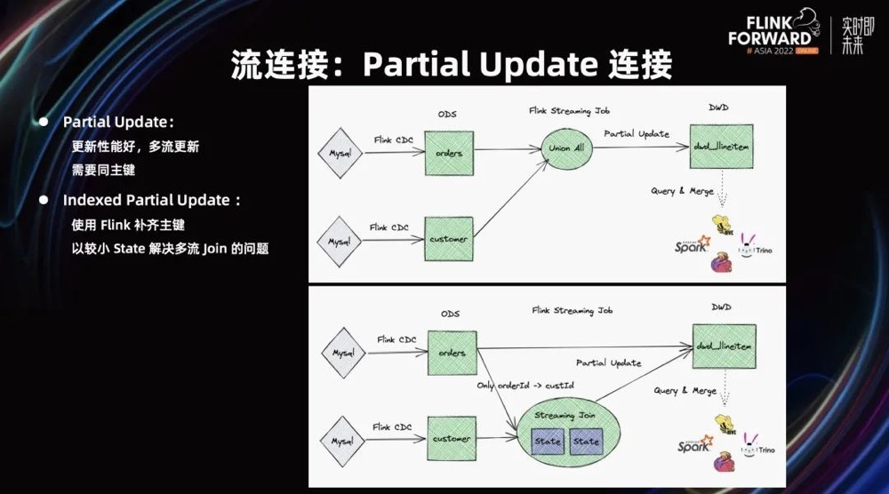
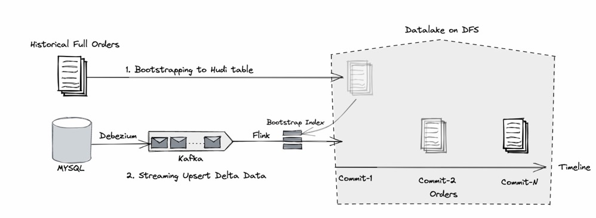

# Paimon生产实践

## Streaming WareHouse的挑战



* 全增量一体摄入。在一个流作业中，全量数据读完之后，无缝切换到增量数据再读，数据和流作业一起进入下一个环节。存储在这里遇到的挑战是，既然有数据全增量一体摄入，说明数据量很大，数据乱序很严重。存储能不能撑住？能不能用高吞吐来支撑全增量一体摄入？
* 消息队列的流读。存储本身作为消息队列需要流写、流读，非常灵活。存储能不能提供全增量一体的流读？能不能指定 timestamp 从历史开始读增量？
* Changelog 的流读。图中的第三部分，Flink 基于 State 的计算严格依赖 Changelog。如果 Changelog 错误，Flink 计算将出现各种各样正确性的问题。当用户输入到存储后，从存储流读的 log 是否准确？变更日志是否完整？这些问题是非常关键。
* 多流 Join 的存储。目前，流计算中 Join 是非常头疼的问题。不光是流计算本身在存储和流计算结合，存储本身也应该在流 Join 上发挥较大的作用。
* 丰富生态的查询。存储跟计算不一样，存储要有比较好的生态。因为不能假设计算能解决一切问题，所以存储需要被各种引擎查询。它必须有一个较好的生态。

## Flink+Paimon的典型场景案例

### 多流表Join


* 上图存在4张业务表实时流，最终需要根据特定的join key形成一张实时大宽表，**一种方案**是多流Join是把这四张表 Join 一下，然后写到存储当中。但是这种方法的代价非常高，存储会成倍增加，成本非常高。**另一种方案**配合Paimon的"partial-update"的merge-engine，来实现Paimon表的局部更新能力，从而将多流Join的大状态等问题解决；
* 使用Paimon的**partial-update** 的能力，使得相同的两张表同时写到一个大宽表当中，更新各自的字段，互不影响。而且因为配置了 changelog-producer，所以在 Compaction 时会产生正确的宽表日志，下游的流读可以读到最新合并后的数据。

#### 相关流表不存在大宽表主键id的问题

* 根据存在主键id的表Lookup Join不存在主键的表的方式来得到一个携带主键id的退货原因表；
* 退货原因表有一个特点是，它的表条数较少，退货表不可更改。所以它比较适合使用 Paimon 作为 Lookup Join 表。进行 Lookup Join，Paimon 会维护一些磁盘 cache。用户不用担心数据量太大，导致 OOM。
* 结合使用 Flink 1.16 Retry Lookup，保证退货表一定能 Join 到 reason 表。即使 reason 表更新较慢，它也能保证 Join 上。通过 Flink Retry Lookup 的方式，成本比较低。

### 流连接问题



* flink常用的流join为双流join或者lookup join。lookup join性能好没有乱序问题，但是无法解决维度表更新的问题；

#### **双流join**

* 假设拿到两个 CDC 的流，按照 Flink SQL 写法，Join 的结果就可以往下写了。此时，Join 要处理两条流，在 Streaming Join 中需要物化，在 State 中保存两个流物化的所有数据。假设 MySQL 中分库分表有 1000 万条，Streaming 中就要保存 1000 万条，而且如果有多个 Join，数据将会被重复的保存，造成大量的成本。
* 双流join语义准确，可以应对维度表更新的问题，但是**对成本和性能上有很大的挑战**(主要涉及双流join时产生的state)。

#### Lookup join

* Lookup Join。假设定义一张叫表叫主流，主流过来需要 Join 补字段。此时，可以把维表当做镜像表，在维表数据来的时候，不断 Lookup 维表数据。Lookup Join 的好处是性能非常好，主表不会乱序，但无法解决维表的更新问题。

#### Partial Update join



* 可以帮助 Streaming 来做 Join 能力。**Partial Update 的本质是存储本身，具有通过组件来更新部分列的能力**。如果两张表都有相同主键，它们可以分别进行 Partial Update。它的好处是**性能非常好，给存储很多空间来优化性能。性能较好，成本较低。但它的缺点是需要有同主键。**

```sql
create table paimonPartialTable(
 id BIGINT PRIMARY KEY NOT ENFORCED,
 c1 STRING,
 c2 STRING
)with(
'merge-engine'='partial-update'
);
insert into paimonPartialTable 
select id,c1,NULL from t1
union all
select id ,NULL,c2 from t2;
```

#### Indexed Partial Update

* **它可以使用 Flink 补齐主键，只需要拿到该主键和主表主键间的映射关系即可**。其次，由于维表的数据量比主表数据量要小很多，所以成本可控。通过使用 Flink 补齐主键之后，以较小 State 解决多流 Join 的问题。

## 数据入湖(仓)实践与痛点

### 全量+定期增量的数据入仓


* 全量数据通过 bulk load 一次性导入，定时调度增量同步任务从数据库同步增量到临时表，再与全量数据进行合并。这种方式存在以下问题：
  * 链路复杂，时效性差:因为下游数仓不支持行级别数据更新，所以下游需要特定的任务来进行数据去重从而得到和业务库快照一致的数据。
  * 明细查询慢，排查问题难

### 全量+实时增量的数据入湖

* 以Apache Hudi为例，首先通过Bootstrap操作将全量历史数据写入hudi，然后基于新接入的 CDC 数据进行实时构建。



* 实时作业需要通过Bootstrap Index来对全量数据构建Index，这样后续实时数据可以upsert方式入湖。
  * Bootstrap Index 超时及 state 膨胀:以流模式启动 Flink 增量同步作业后，系统会先将全量表导入到 Flink state 来构建 Hoodie key（即主键 + 分区路径）到写入文件的 file group 的索引，此过程会阻塞 checkpoint 完成。而只有在 checkpoint 成功后，写入的数据才可以变为可读状态，故而当全量数据很大时，有可能会出现 checkpoint 一直超时的情况，导致下游读不到数据。另外，由于索引一直保存在 state 内，在增量同步阶段遇到了 insert 类型的记录也会更新索引，需要合理评估 state TTL，配置太小可能会丢失数据，配置过大可能导致 state 膨胀。
  * 链路依然复杂，难以对齐增量点位，自动化运维成本高

### 全增量数据入湖数据入湖

#### 存在的问题

* 全量同步阶段数据乱序严重，写入性能和稳定性难以保障 
  * 在全量同步阶段面临的一个问题是多并发同时读取 chunk 会遇到严重的数据乱序，出现同时写多个分区的情况，大量的随机写入会导致性能回退，出现吞吐毛刺，每个分区对应的 writer 都要维护各自缓存，很容易发生 OOM 导致作业不稳定。
  * Hudi通过RateLimit配置来限制每分钟的数据写入来起到一定的平滑效果，但是整体的性能调优使用门槛偏高；

#### Flink CDC+Paimon方式


* 大吞吐量的更新数据摄取，支持全增量一体入湖
  * 全增量一体化同步入湖的主要挑战在于全量同步阶段产生了大量数据乱序引起的随机写入，导致性能回退、吞吐毛刺及不稳定。Paimon存储格式使用先分区（Partition）再分桶（Bucket），每个桶内各自维护一棵 LSM（Log-structured Merge Tree）的方式，每条记录通过主键哈希落入桶内时就确定了写入路径（Directory），以 KV 方式写入 MemTable 中（类似于 HashMap，Key 就是主键，Value 是记录）。在 flush 到磁盘的过程中，以主键排序合并（去重），以追加方式写入磁盘。Sort Merge 在 buffer 内进行，避免了需要点查索引来判断一条记录是 insert 还是 update 来获取写入文件的 file group 的 tagging [Apache Hudi Technical Specification#Writer Expectations](https://hudi.apache.org/tech-specs/#writer-expectations)[5] 。另外，触发 MemTable flush 发生在 buffer 充满时，不需要额外通过 Auto-File Sizing [Apache Hudi Write Operations#Writing path](https://hudi.apache.org/docs/next/write_operations/#writing-path)[6]（Auto-File Sizing 会影响写入速度 [Apache Hudi File Sizing#Auto-Size During ingestion](https://hudi.apache.org/docs/next/file_sizing/#auto-size-during-ingestion)[7]）来避免小文件产生，整个写入过程都是局部且顺序的 [On Disk IO, Part 3: LSM Trees](https://medium.com/databasss/on-disk-io-part-3-lsm-trees-8b2da218496f) [8]，避免了随机 IO 产生。

* 高效 Data Skipping 支持过滤，提供高性能的点查和范围查询
  * 虽然没有额外的索引，但是得益于 meta 的管理和列存格式，manifest 中保存了
    * 文件的主键的 min/max 及每个字段的统计信息，这可以在不访问文件的情况下，进行一些 predicate 的过滤
    * orc/parquet 格式中，文件的尾部记录了稀疏索引，每个 chunk 的统计信息和 offset，这可以通过文件的尾部信息，进行一些 predicate 的过滤
    * 数据在有 filter 读取时，可以根据上述信息做如下过滤
      * 读取 manifest：根据文件的 min/max、分区，执行分区和字段的 predicate，淘汰多余的文件
      *  读取文件 footer：根据 chunk 的 min/max，过滤不需要读取的 chunk
      *  读取剩下与文件以及其中的 chunks
* 文件格式支持流读
  * Paimon实现了 Incremental Scan，在流模式下，可以持续监听文件更新，数据新鲜度保持在分钟级别。