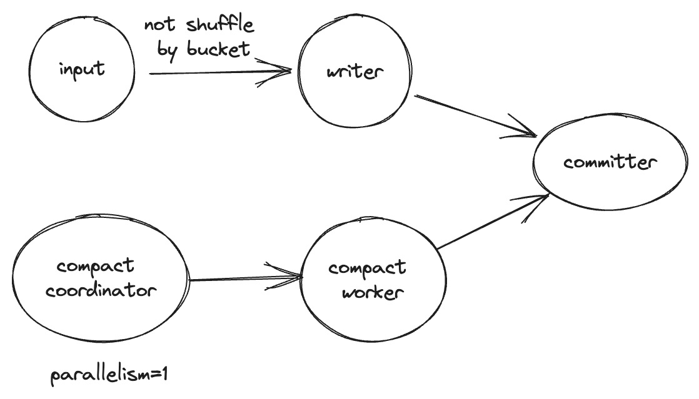
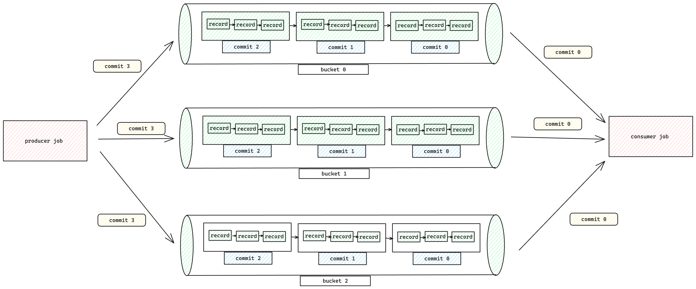

# Overview

* 如果一个表没有定义主键，它是一张append表。与主键表相比，它不具有直接接收更改日志的能力。它不能通过upsert直接更新数据，它只能接收来自append的传入数据。

```sql
CREATE TABLE my_table (
    product_id BIGINT,
    price DOUBLE,
    sales BIGINT
) WITH (
    -- 'target-file-size' = '256 MB',
    -- 'file.format' = 'parquet',
    -- 'file.compression' = 'zstd',
    -- 'file.compression.zstd-level' = '3'
);
```

* 批量写和批量读在典型的应用场景中，类似于一个普通的Hive分区表，但是相比Hive表，它的优点如下：
  * 对象存储（S3，OSS）友好
  * Time Travel 和 Rollback
  * 低成本DELETE / UPDATE
  * 流式sink中动态合并小文件
  * 像消息队列一样支持流式读&写
  * 具有顺序和索引的高性能查询

# Streaming

* 通过Flink以一种非常灵活的方式流式写入Append表，或者通过Flink读取Append表，将其像队列一样使用。唯一的区别是它的延迟是**以分钟**为单位的。它的优点是成本非常低，并且支持算子下推和projection能力。

## 动态小文件合并

* 在流写作业中，如果没有桶定义，writer就没有compaction，而是使用`Compact Coordinator`扫描小文件，然后将compaction任务传递给`Compact Worker`。在流模式下，如果在flink中运行insert sql，拓扑结构如下：



* 不用担心背压问题，compaction从不会背压。
* 如果`write-only`设置为`true`,`Compact Coordinator`和`Compact Worker`将会被移除。
* 自动compaction仅在Flink引擎流模式下支持。您还可以在paimon中通过flink action启动一个compaction作业，并通过set `write-only`为`true`禁用所有其他compaction作业。

## 流式查询

* 可以流式读取Append表，并像使用消息队列一样使用它。与主键表一样，流式读取有两种配置：
  * 默认情况下，流式读取在第一次启动时生成表上的最新快照，并继续读取最新的增量记录。
  * 通过指定`scan.mode` 或 `scan.snapshot-id`或`scan.timestamp-millis` 或 `scan.file-creation-time-millis`来实现增量读取。
* 类似于flink-kafka，默认情况下不保证顺序，如果你需要强有序的读取数据，需要定义`bucket-key`,类似于kafka中的key，保障单分区有序，Flink保障单bucket有序。

## Bucketd Append

* 普通的append表对它的流写和读没有严格的顺序保证，但是在某些情况下，你需要定义一个类似于Kafka的key，来保证append表可以有序读写。通过定义`bucket`和`bucket-key`配置bucketed append表，任何记录在相同的bucket是严格有序的，流式读取将按照写入的顺序将记录传输到下游。



```sql
-- 定义bucketed appended表
CREATE TABLE my_table (
    product_id BIGINT,
    price DOUBLE,
    sales BIGINT
) WITH (
    'bucket' = '8',
    'bucket-key' = 'product_id'
);
```

### bucket的copmaction配置

* 默认情况下，sink node将会动态高效的执行Compaction来控制文件的个数，下列配置可以控制Compaction的策略：

| Key                           | Default | Type    | Description                                                  |
| :---------------------------- | :------ | :------ | :----------------------------------------------------------- |
| write-only                    | false   | Boolean | 如果设置为true，Compaction和snapshot过期将会被跳过。这个配置通常配合独立的copmact任务一起使用。 |
| compaction.min.file-num       | 5       | Integer | 对于文件集[f_0,...,f_N]，满足sum(size(f_i)) >= targetFileSize 触发append表compaction的最小文件数。这个值避免了几乎全部文件被压缩，因为Compaction是不划算的。 |
| compaction.max.file-num       | 50      | Integer | 对于文件集[f_0,...,f_N]，触发Compaction的最大文件个数，即sum(size(f_i)) < targetFileSize,这个配置避免存在过多小文件，导致性能变差。 |
| full-compaction.delta-commits | (none)  | Integer | delta-commits多少个后触发full-compaction                     |

### 顺序流式读取

* 对于流式读取，记录按以下顺序生成：
  * 对于来自两个不同分区的任意两条记录
    * 如果`scan.plan-sort-partition`设置为`true`,则首先生成分区值小的值。
    * 否则，将首先生成分区创建时间较早的记录。
  * 对于来自同一分区和同一桶的任意两条记录，将首先生成第一个写入的记录。
  * 对于来自同一分区但不同桶的任意两条记录，不同桶由不同的任务处理，它们之间没有顺序保证。

### Watermark定义

* 为读取的paimon表定义Watermark:

```sql
CREATE TABLE t (
    `user` BIGINT,
    product STRING,
    order_time TIMESTAMP(3),
    WATERMARK FOR order_time AS order_time - INTERVAL '5' SECOND
) WITH (...);

-- launch a bounded streaming job to read paimon_table
SELECT window_start, window_end, COUNT(`user`) FROM TABLE(
 TUMBLE(TABLE t, DESCRIPTOR(order_time), INTERVAL '10' MINUTES)) GROUP BY window_start, window_end;
```

* 启用Flink Watermark对齐方式，这将确保任何sources/splits/shards/partitions都在其余部分中提高其Watermark：

| Key                                | Default | Type     | Description                                                  |
| :--------------------------------- | :------ | :------- | :----------------------------------------------------------- |
| scan.watermark.alignment.group     | (none)  | String   | 一组用于对齐Watermark的source。                              |
| scan.watermark.alignment.max-drift | (none)  | Duration | 在我们暂停消费source/task/partition之前，最大的Watermark偏移 |

### 有界流

* 流式数据源也可以有界，可以指定`scan.bounded.watermark`来定义有界流模式的结束条件，直到遇到更大的Watermark快照，流读取才会结束。
* 快照中的Watermark是由writer生成的，例如可以指定一个kafka源，并声明Watermark的定义。当使用这个kafka源对Paimon表进行写操作时，Paimon表的快照会生成相应的Watermark，这样流式读取这个Paimon表时就可以使用有界Watermark的特性。

```sql
CREATE TABLE kafka_table (
    `user` BIGINT,
    product STRING,
    order_time TIMESTAMP(3),
    WATERMARK FOR order_time AS order_time - INTERVAL '5' SECOND
) WITH ('connector' = 'kafka'...);

-- launch a streaming insert job
INSERT INTO paimon_table SELECT * FROM kakfa_table;

-- launch a bounded streaming job to read paimon_table
SELECT * FROM paimon_table /*+ OPTIONS('scan.bounded.watermark'='...') */;
```

# Query

## 按顺序Data Skipping

* 默认情况下，Paimon记录中每个字段的最大值和最小值在mainfest文件中，在查询中，根据查询的`WHERE`条件，根据`manifest`中的统计信息做文件过滤，如果过滤效果好，将查询本来分分钟的查询加速到毫秒级完成执行。
* 通常数据分布并不总是有效的过滤，如果我们能在`WHERE`条件下按字段对数据进行排序，将会大大提升查询性能，参考： [Flink COMPACT Action](https://paimon.apache.org/docs/master/maintenance/dedicated-compaction/#sort-compact) or [Flink COMPACT Procedure](https://paimon.apache.org/docs/master/flink/procedures/) or [Spark COMPACT Procedure](https://paimon.apache.org/docs/master/spark/procedures/).

## 通过Index Data Skipping

* 可以使用文件索引，它在读取端通过索引过滤文件。

```sql
CREATE TABLE <PAIMON_TABLE> (<COLUMN> <COLUMN_TYPE> , ...) WITH (
    'file-index.bloom-filter.columns' = 'c1,c2',
    'file-index.bloom-filter.c1.items' = '200'
);
```

* 定义`file-index.bloom-filter.columns`时，Paimon将为每个文件创建相应的索引文件。**如果索引文件太小，它将直接存储在mainfest文件中，否则存储在数据文件的目录中**。**每个数据文件对应一个索引文件**，索引文件有一个单独的文件定义，可以包含不同类型的索引和多个列。
* 数据文件索引是**某个数据文件对应的外部索引文件**。不同的文件索引在不同的场景下是不一样的。例如，在点查找场景中，bloom过滤器可以加快查询速度。使用位图可能会占用更多空间，但可以获得更高的准确性。
* 当前，**文件索引仅支持append-only表**
* Bllom Filter索引配置：
  * `file-index.bloom-filter.columns`: 指定那些列需要bloom filter索引
  * `file-index.bloom-filter.<column_name>.fpp` 配置误报概率
  * `file-index.bloom-filter.<column_name>.items`在一个数据文件中配置预期的不同items
* 如果您想在现有表中添加文件索引，而不需要重写，您可以使用`rewrite_file_inde`过程。在使用该过程之前，应该在目标表中配置适当的配置。使用`ALTER`子句配置`file-index.<filter-type>.columns`在表里。

# Update

* 当前，只有Spark SQL支持`DELETE`和`UPDATE`语法，具体查看 [Spark Write](https://paimon.apache.org/docs/master/spark/sql-write/).

```sql
DELETE FROM my_table WHERE currency = 'UNKNOWN';
```

* Update Append表的俩种模式：
  * COW (Copy on Write): 搜索命中的文件，然后重写每个文件以删除需要从文件中删除的数据。此操作过重。
  * MOW (Merge on Write): 通过指定'deletion-vectors.enabled' = 'true',删除向量模式可以启用。只标记相应文件的某些记录进行删除，并写入删除文件，不重写整个文件，查询的时候过滤被删除的记录，得到最终结果。