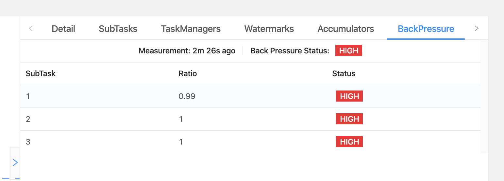
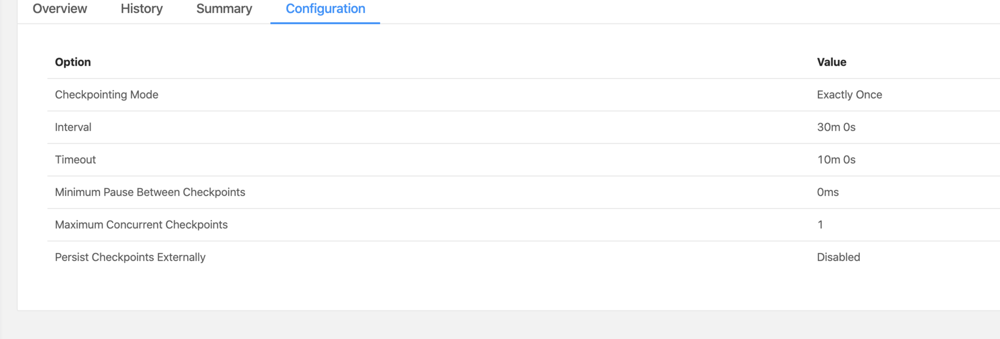
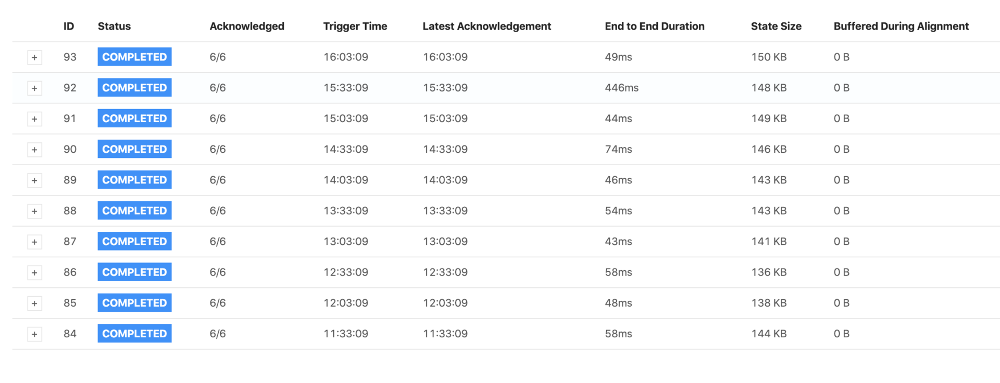
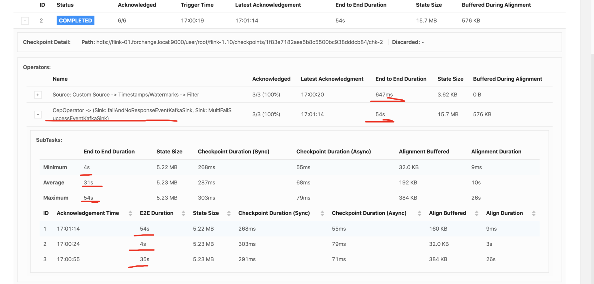
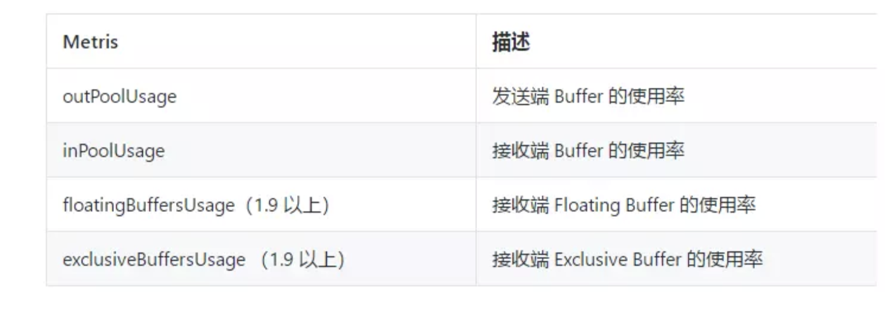
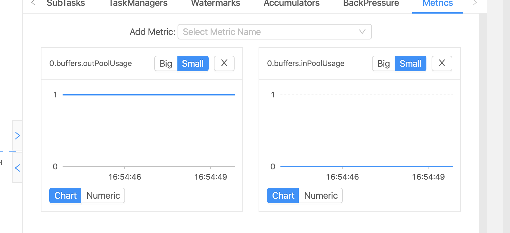
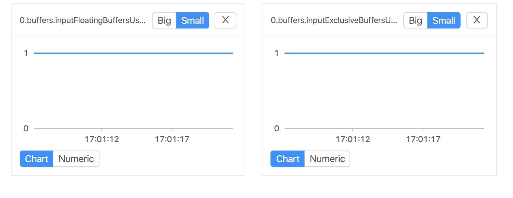
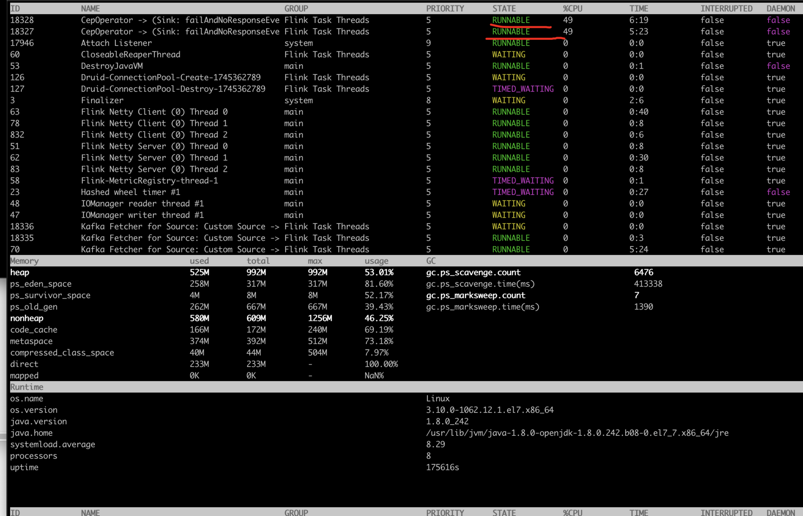
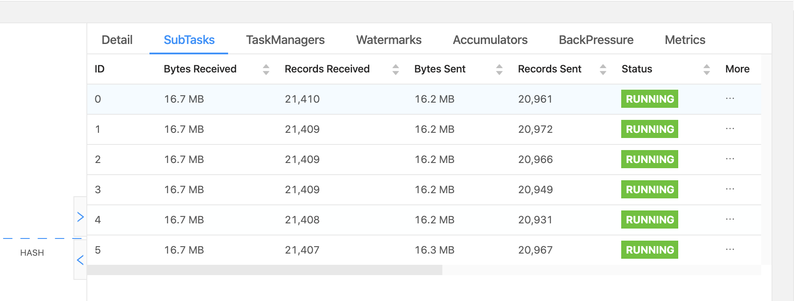

# 问题出现

根据subtask的watermark发现延迟了10几分钟，然后查看是否有异常或者BackPressure的情况最终发现，source->watermarks->filter端三个subtask反压都显示High

- 重启多次，问题依然存在。
# 反压的定位
[https://ververica.cn/developers/how-to-analyze-and-deal-with-flink-back-pressure/](https://ververica.cn/developers/how-to-analyze-and-deal-with-flink-back-pressure/)

- 正常任务checkpoint时间端发现非常短

- 反压任务

- 大约可以看出来checkpoint做的时间过程，并且内部基本上是下游的subtask任务耗时比较长，因此初步怀疑是因为下游sink原因。

**分析上游的subtask的Metrics**

**分析下游subtask的metrics**

- 如果一个 Subtask 的发送端 Buffer 占用率很高，则表明它被下游反压限速了；如果一个 Subtask 的接受端 Buffer 占用很高，则表明它将反压传导至上游。
- outPoolUsage 和 inPoolUsage 同为低或同为高分别表明当前 Subtask 正常或处于被下游反压，这应该没有太多疑问。而比较有趣的是当 outPoolUsage 和 inPoolUsage 表现不同时，这可能是出于反压传导的中间状态或者表明该 Subtask 就是反压的根源。
- 如果一个 Subtask 的 outPoolUsage 是高，通常是被下游 Task 所影响，所以可以排除它本身是反压根源的可能性。如果一个 Subtask 的 outPoolUsage 是低，但其 inPoolUsage 是高，则表明它有可能是反压的根源。因为通常反压会传导至其上游，导致上游某些 Subtask 的 outPoolUsage 为高，我们可以根据这点来进一步判断。值得注意的是，反压有时是短暂的且影响不大，比如来自某个 Channel 的短暂网络延迟或者 TaskManager 的正常 GC，这种情况下我们可以不用处理。
- 可以分析出来下游反压导致的上游反压问题

- 通常来说，inputFloatingBuffersUsage 为高则表明反压正在传导至上游，而 inputExclusiveBuffersUsage 则表明了反压是否存在倾斜（inputFloatingBuffersUsage 高、inputExclusiveBuffersUsage 低为有倾斜，因为少数 channel 占用了大部分的 Floating Buffer）。

# 分析原因

- 可以看出来subtask的数据并不是特别的倾斜

> **此外，最常见的问题可能是用户代码的执行效率问题（频繁被阻塞或者性能问题）**。最有用的办法就是对 TaskManager 进行 CPU profile，从中我们可以分析到 Task Thread 是否跑满一个 CPU 核：如果是的话要分析 CPU 主要花费在哪些函数里面，比如我们生产环境中就偶尔遇到卡在 Regex 的用户函数（ReDoS）；如果不是的话要看 Task Thread 阻塞在哪里，可能是用户函数本身有些同步的调用，可能是 checkpoint 或者 GC 等系统活动导致的暂时系统暂停。
> 当然，性能分析的结果也可能是正常的，只是作业申请的资源不足而导致了反压，这就通常要求拓展并行度。值得一提的，在未来的版本 Flink 将会直接在 WebUI 提供 JVM 的 CPU 火焰图[5]，这将大大简化性能瓶颈的分析。
> **另外 TaskManager 的内存以及 GC 问题也可能会导致反压**，包括 TaskManager JVM 各区内存不合理导致的频繁 Full GC 甚至失联。推荐可以通过给 TaskManager 启用 G1 垃圾回收器来优化 GC，并加上 -XX:+PrintGCDetails 来打印 GC 日志的方式来观察 GC 的问题。

# 测试解决

- 调整sink to kafka为print打印控制台

发现仍然存在反压问题，排除sink写入kafka速度过慢问题，因原来写es存在延迟因此改为kafka，因此这一次先排除这个问题。

- 降低cep时间时间窗口大小，由3分钟-》1分钟-》20s

反压出现的时间越来越靠后，大体问题定位在cep算子相关，并且此时每次checkpoint的时间在增大，尽管state的大小相同但是时间成倍增大，故修改checkpoint相关配置继续测试发现问题仍然存在

- 分析线程taskmanager线程占比，发现cep算子占用cpu百分之94，故增大算子并发度3为6线程cpu占用降低如下健康状态

- 反压经历一段时间也没有再出现，后续会持续跟进，并且会尝试调大cep的时间窗口，尝试配置出最佳实践
- 增大分区后发现数据倾斜严重，因为kafka分区为3，但是并行度为6因此cep算子的6个subtask数据倾斜严重，因此在添加source端执行reblance方法，强制轮询方式分配数据

- 可以看出来这里数据相比以前均匀很多

# Cep配置

- 并行度，kafka分区的double
- cep时间窗口：30s
- sink：2个sink到kafka
