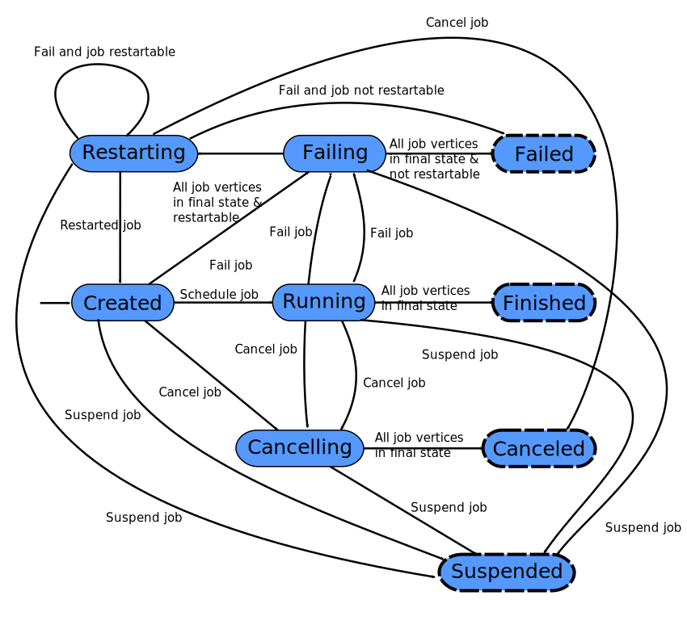
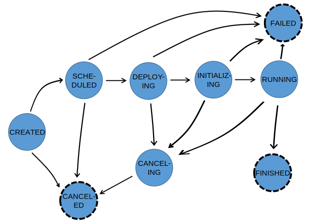

# 作业调度

* 描述了 Flink 怎样调度作业, 怎样在 JobManager 里描述和追踪作业状态

## 调度

* Flink 通过 *Task Slots* 来定义执行资源。每个 TaskManager 有一到多个 task slot，每个 task slot 可以运行一条由多个并行 task 组成的流水线。 这样一条流水线由多个连续的 task 组成，比如并行度为 *n* 的 MapFunction 和 并行度为 *n* 的 ReduceFunction。需要注意的是 Flink 经常并发执行连续的 task，不仅在流式作业中到处都是，在批量作业中也很常见。
* 下图很好的阐释了这一点，一个由数据源、*MapFunction* 和 *ReduceFunction* 组成的 Flink 作业，其中数据源和 MapFunction 的并行度为 4 ，ReduceFunction 的并行度为 3 。流水线由一系列的 Source - Map - Reduce 组成，运行在 2 个 TaskManager 组成的集群上，每个 TaskManager 包含 3 个 slot，整个作业的运行如下图所示。


* Flink 内部通过 [SlotSharingGroup ](https://github.com/apache/flink/blob/release-1.20//flink-runtime/src/main/java/org/apache/flink/runtime/jobmanager/scheduler/SlotSharingGroup.java)和 [CoLocationGroup ](https://github.com/apache/flink/blob/release-1.20//flink-runtime/src/main/java/org/apache/flink/runtime/jobmanager/scheduler/CoLocationGroup.java)来定义哪些 task 可以共享一个 slot， 哪些 task 必须严格放到同一个 slot。

## JobManager 数据结构

* 在作业执行期间，JobManager 会持续跟踪各个 task，决定何时调度下一个或一组 task，处理已完成的 task 或执行失败的情况。
* JobManager 会接收到一个 [JobGraph ](https://github.com/apache/flink/blob/release-1.20//flink-runtime/src/main/java/org/apache/flink/runtime/jobgraph/)，用来描述由多个算子顶点 ( [JobVertex ](https://github.com/apache/flink/blob/release-1.20//flink-runtime/src/main/java/org/apache/flink/runtime/jobgraph/JobVertex.java)) 组成的数据流图，以及中间结果数据 ( [IntermediateDataSet ](https://github.com/apache/flink/blob/release-1.20//flink-runtime/src/main/java/org/apache/flink/runtime/jobgraph/IntermediateDataSet.java))。每个算子都有自己的可配置属性，比如并行度和运行的代码。除此之外，JobGraph 还包含算子代码执行所必须的依赖库。
* JobManager 会将 JobGraph 转换成 [ExecutionGraph ](https://github.com/apache/flink/blob/release-1.20//flink-runtime/src/main/java/org/apache/flink/runtime/executiongraph/)。可以将 ExecutionGraph 理解为并行版本的 JobGraph，对于每一个顶点 JobVertex，它的每个并行子 task 都有一个 [ExecutionVertex ](https://github.com/apache/flink/blob/release-1.20//flink-runtime/src/main/java/org/apache/flink/runtime/executiongraph/ExecutionVertex.java)。一个并行度为 100 的算子会有 1 个 JobVertex 和 100 个 ExecutionVertex。ExecutionVertex 会跟踪子 task 的执行状态。 同一个 JobVertex 的所有 ExecutionVertex 都通过 [ExecutionJobVertex ](https://github.com/apache/flink/blob/release-1.20//flink-runtime/src/main/java/org/apache/flink/runtime/executiongraph/ExecutionJobVertex.java)来持有，并跟踪整个算子的运行状态。ExecutionGraph 除了这些顶点，还包含中间数据结果和分片情况 [IntermediateResult ](https://github.com/apache/flink/blob/release-1.20//flink-runtime/src/main/java/org/apache/flink/runtime/executiongraph/IntermediateResult.java)和 [IntermediateResultPartition ](https://github.com/apache/flink/blob/release-1.20//flink-runtime/src/main/java/org/apache/flink/runtime/executiongraph/IntermediateResultPartition.java)。前者跟踪中间结果的状态，后者跟踪每个分片的状态。


* 每个 ExecutionGraph 都有一个与之相关的作业状态信息，用来描述当前的作业执行状态。
* Flink 作业刚开始会处于 *created* 状态，然后切换到 *running* 状态，当所有任务都执行完之后会切换到 *finished* 状态。如果遇到失败的话，作业首先切换到 *failing* 状态以便取消所有正在运行的 task。如果所有 job 节点都到达最终状态并且 job 无法重启， 那么 job 进入 *failed* 状态。如果作业可以重启，那么就会进入到 *restarting* 状态，当作业彻底重启之后会进入到 *created* 状态。
* 如果用户取消了 job 话，它会进入到 *cancelling* 状态，并取消所有正在运行的 task。当所有正在运行的 task 进入到最终状态的时候，job 进入 *cancelled* 状态。
* *Finished*、*canceled* 和 *failed* 会导致全局的终结状态，并且触发作业的清理。跟这些状态不同，*suspended* 状态只是一个局部的终结。局部的终结意味着作业的执行已经被对应的 JobManager 终结，但是集群中另外的 JobManager 依然可以从高可用存储里获取作业信息并重启。因此一个处于 *suspended* 状态的作业不会被彻底清理掉。



* 在整个 ExecutionGraph 执行期间，每个并行 task 都会经历多个阶段，从 *created* 状态到 *finished* 或 *failed*。下图展示了各种状态以及他们之间的转换关系。由于一个 task 可能会被执行多次(比如在异常恢复时)，ExecutionVertex 的执行是由 [Execution ](https://github.com/apache/flink/blob/release-1.20//flink-runtime/src/main/java/org/apache/flink/runtime/executiongraph/Execution.java)来跟踪的，每个 ExecutionVertex 会记录当前的执行，以及之前的执行。



# Task 生命周期

* Task 是 Flink 的基本执行单元。算子的每个并行实例都在 task 里执行。例如，一个并行度为 *5* 的算子，它的每个实例都由一个单独的 task 来执行。
* `StreamTask` 是 Flink 流式计算引擎中所有不同 task 子类的基础。这一部分会讲解 `StreamTask` 生命周期的不同阶段，并阐述每个阶段的主要方法。

## 算子生命周期简介

* task 是算子并行实例的执行实体，所以它的生命周期跟算子的生命周期紧密联系在一起。因此，在深入介绍 `StreamTask` 生命周期之前，先简要介绍一下代表算子生命周期的基本方法。这些方法按调用的先后顺序如下所示。考虑到算子可能是用户自定义函数（*UDF*），因此我们在每个算子下也展示（以缩进的方式）了 UDF 生命周期中调用的各个方法。`AbstractUdfStreamOperator` 是所有执行 UDF 的算子的基类，如果算子继承了 `AbstractUdfStreamOperator`，那么这些方法都是可用的。

```
    // 初始化阶段
    OPERATOR::setup
        UDF::setRuntimeContext
    OPERATOR::initializeState
    OPERATOR::open
        UDF::open
    // 处理阶段（对每个 element 或 watermark 调用）
    OPERATOR::processElement
        UDF::run
    OPERATOR::processWatermark
    // checkpointing 阶段（对每个 checkpoint 异步调用）
    OPERATOR::snapshotState
    // 通知 operator 处理记录的过程结束
    OPERATOR::finish
    // 结束阶段
    OPERATOR::close
        UDF::close
```

* 简而言之，在算子初始化时调用 `setup()` 来初始化算子的特定设置，比如 `RuntimeContext` 和指标收集的数据结构。在这之后，算子通过 `initializeState()` 初始化状态，算子的所有初始化工作在 `open()` 方法中执行，比如在继承 `AbstractUdfStreamOperator` 的情况下，初始化用户自定义函数。

> `initializeState()` 既包含在初始化过程中算子状态的初始化逻辑（比如注册 keyed 状态），又包含异常后从 checkpoint 中恢复原有状态的逻辑。在接下来的篇幅会进行更详细的介绍。

* 当所有初始化都完成之后，算子开始处理流入的数据。流入的数据可以分为三种类型：用户数据、watermark 和 checkpoint barriers。每种类型的数据都有单独的方法来处理。用户数据通过 `processElement()` 方法来处理，watermark 通过 `processWatermark()` 来处理，checkpoint barriers 会调用（异步）`snapshotState()` 方法触发 checkpoint。对于每个流入的数据，根据其类型调用上述相应的方法。注意，`processElement()` 方法也是用户自定义函数逻辑执行的地方，比如用户自定义 `MapFunction` 里的 `map()` 方法。
* 最后，在算子正常无故障的情况下（比如，如果流式数据是有限的，并且最后一个数据已经到达），会调用 `finish()` 方法结束算子并进行必要的清理工作（比如刷新所有缓冲数据，或发送处理结束的标记数据）。在这之后会调用 `close()` 方法来释放算子持有的资源（比如算子数据持有的本地内存）。
* 在作业失败或手动取消的情况下，会略过从算子异常位置到 `close()` 中间的所有步骤，直接跳到 `close()` 方法结束算子。

**Checkpoints:** 算子的 `snapshotState()` 方法是在收到 checkpoint barrier 后异步调用的。Checkpoint 在处理阶段执行，即算子打开之后，结束之前的这个阶段。这个方法的职责是存储算子的当前状态到一个特定的[状态后端](https://nightlies.apache.org/flink/flink-docs-release-1.20/zh/docs/ops/state/state_backends/)，当作业失败后恢复执行时会从这个后端恢复状态数据。

## Task 生命周期 

* 在上文对算子主要阶段的简介之后，本节将详细介绍 task 在集群执行期间是如何调用相关方法的。这里所说的阶段主要包含在 `StreamTask` 类的 `invoke()` 方法里。本文档后续内容将分成两个子章节，一节描述了 task 在正常无故障情况下的执行阶段（请参考[常规执行](https://nightlies.apache.org/flink/flink-docs-release-1.20/zh/docs/internals/task_lifecycle/#normal-execution)），另一节（稍微简短的部分）描述了 task 取消之后的执行阶段（请参考[中断执行](https://nightlies.apache.org/flink/flink-docs-release-1.20/zh/docs/internals/task_lifecycle/#interrupted-execution)），不管是手动取消还是其他原因（比如执行期间遇到异常）导致的取消。

### 常规执行

* Task 在没有中断的情况下执行到结束的阶段如下所示：

```
    TASK::setInitialState
    TASK::invoke
	    create basic utils (config, etc) and load the chain of operators
	    setup-operators
	    task-specific-init
	    initialize-operator-states
   	    open-operators
	    run
	    finish-operators
	    wait for the final checkponit completed (if enabled)
	    close-operators
	    task-specific-cleanup
	    common-cleanup
```

* 如上所示，在恢复 task 配置和初始化一些重要的运行时参数之后，task 的下一步是读取 task 级别的初始状态。这一步在 `setInitialState()` 方法里完成，在下面两种情况尤其重要：
  * 当 Task 从失败中恢复并从最近一次成功的 checkpoint 重启的时候
  * 当 Task 从 [savepoint](https://nightlies.apache.org/flink/flink-docs-release-1.20/zh/docs/ops/state/savepoints/) 恢复的时候。

* 如果 task 是第一次执行的话，它的初始状态为空。
* 在恢复初始状态之后，task 进入到 `invoke()` 方法。在这里，首先调用 `setup()` 方法来初始化本地计算涉及到的每个算子，然后调用本地的 `init()` 方法来做特定 task 的初始化。这里所说的特定 task，取决于 task 的类型 (`SourceTask`、`OneInputStreamTask` 或 `TwoInputStreamTask` 等)。这一步可能会有所不同，但无论如何这是获取 task 范围内所需资源的地方。例如，`OneInputStreamTask`，代表期望一个单一输入流的 task，初始化与本地任务相关输入流的不同分区位置的连接。
* 在申请到必要的资源之后，不同算子和用户定义函数开始从上面读到的 task 范围状态数据里获取它们各自的状态值。这一部分是算子调用 `initializeState()` 完成的。每个有状态的算子都应该重写该方法，包含状态的初始化逻辑，既适用于作业第一次执行的场景，又适用于 task 从 checkpoint 或 savepoint 中恢复的场景。
* 现在 task 里的所有算子都已经被初始化了，每个算子里的 `open()`方法也通过 `StreamTask` 的 `openAllOperators()` 方法调用了。这个方法执行所有操作的初始化，比如在定时器服务里注册获取到的定时器。一个 task 可能会执行多个算子，即一个算子消费它之前算子的输出数据流。在这种情况下，`open()` 方法从最后一个算子调用到第一个算子，即最后一个算子的输出刚好也是整个 task 的输出。这样做是为了当第一个算子开始处理 task 的输入数据流时，所有下游算子已经准备接收它的输出数据了。

> task 里多个连续算子的开启是从后往前依次执行。

* 现在 task 可以恢复执行，算子可以开始处理新输入的数据。在这里，特定 task 的 `run()` 方法会被调用。这个方法会一直运行直到没有更多输入数据进来（有限的数据流）或者 task 被取消了（人为的或其他的原因）。这里也是算子定义的 `processElement()` 方法和 `processWatermark()` 方法执行的地方。
* 在运行到完成的情况下，即没有更多的输入数据要处理，从run()方法退出后，task 进入关闭阶段。首先定时器服务停止注册任何新的定时器（比如从正在执行的定时器里注册），清理掉所有还未启动的定时器，并等待当前执行中的定时器运行结束。然后通过调用 `finishAllOperators()` 方法调用每个算子的 `finish()` 方法来通知所有参与计算的算子。然后所有缓存的输出数据会刷出去以便下游 task 处理。 如果开启了部分任务结束后继续 checkpoint 的功能，任务将 [等待下一个 checkpoint 结束](https://nightlies.apache.org/flink/flink-docs-release-1.20/zh/docs/dev/datastream/fault-tolerance/checkpointing/#任务结束前等待最后一次-checkpoint) 来保证使用两阶段提交的算子可能最终提交所有的记录。 最终 task 通过调用每个算子的 `close()` 方法来尝试清理掉算子持有的所有资源。与我们之前提到的开启算子不同是，开启时从后往前依次调用 `open()`；而关闭时刚好相反，从前往后依次调用 `close()`。

> task 里的多个连续算子的关闭是从前往后依次执行。

* 最后，当所有算子都已经关闭，所有资源都已被释放时，task 关掉它的定时器服务，进行特定 task 的清理操作，例如清理掉所有内部缓存，然后进行常规的 task 清理操作，包括关闭所有的输出管道，清理所有输出缓存等。

**Checkpoints:** 之前我们看到在执行 `initializeState()` 方法期间，在从异常失败中恢复的情况下，task 和它内部的所有算子函数都从最后一次成功的 checkpoint 数据里获取对应的状态信息。Flink 里的 checkpoint 是根据用户自定义的时间间隔周期执行的，并且在一个与主 task 线程不同的单独线程里执行。这也是我们没有把 checkpoint 过程涵盖在 task 生命周期的主要阶段里的原因。简而言之，Flink 作业的输入数据 source task 会定时插入一种叫 `checkpoint barrier` 的特殊数据，并跟正常数据一起从 source 流入到 sink。source task 在处于运行模式后发送这些 barrier，同时会假设 `CheckpointCoordinator` 也在运行。当 task 接收到这样的 barrier 之后，会通过 task 算子里的 `snapshotState()` 方法调度 checkpoint 线程执行具体任务。在 checkpoint 处理期间，task 依然可以接收输入数据，但是数据会被缓存起来，当 checkpoint 执行成功之后才会被处理和发送到下游算子。

### 中断执行

* 在前面的章节，我们描述的是运行直到完成的 task 生命周期。在任意时间点取消 task 的话，正常的执行过程会被中断，从这个时候开始只会进行以下操作，关闭定时器服务、执行特定 task 的清理、执行所有算子的关闭，执行常规 task 的清理。