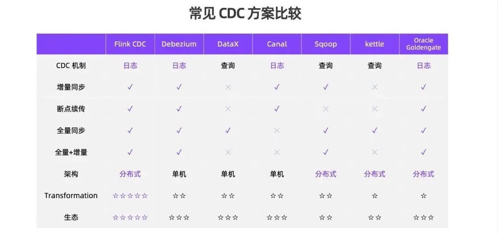

# Flink CDC技术对比与分析

## 变更数据捕获(CDC)数据

* 广义概念上，能够捕获数据变更的技术统称为 CDC（**Change Data Capture**）。通常我们说的 CDC 主要面向数据库的变更，是一种用于捕获数据库中数据变化的技术。
* CDC 的主要应用有三个方面：
  * **数据同步**，通过 CDC 将数据同步到其他存储位置来进行异地灾备或备份。
  * **数据分发**，通过 CDC 将数据从一个数据源抽取出来后分发给下游各个业务方做数据处理和变换。
  * **数据采集**，使用 CDC 将源端数据库中的数据读取出来后，经过 ETL 写入数据仓库或数据湖。

* CDC实现机制
  * **基于查询**
    * 基于查询的 CDC 通过定时调度离线任务的方式实现，一般为批处理模式，无法保证数据的实时性，数据一致性也会受到影响。
  * **基于日志的 CDC**
    * 基于日志的 CDC 通过实时消费数据库里的日志变化实现，如通过连接器直接读取 MySQL 的 binlog 捕获变更。这种流处理模式可以做到低延迟，因此更好地保障了数据的实时性和一致性。

## Flink CDC的优势



- 在实现机制方面，Flink CDC 通过直接读取数据库日志捕获数据变更，保障了数据实时性和一致性。
- 在同步能力方面，Flink CDC 支持全量和增量两种读取模式，并且可以做到无缝切换。
- 在数据连续性方面，Flink CDC 充分利用了 Apache Flink 的 checkpoint 机制，提供了断点续传功能，当作业出现故障重启后可以从中断的位置直接启动恢复。
- 在架构方面，Flink CDC 的分布式设计使得用户可以启动多个并发来消费源库中的数据。
- 在数据变换方面，Flink CDC 将从数据库中读取出来后，可以通过 DataStream、SQL 等进行各种复杂计算和数据处理。
- 在生态方面，Flink CDC 依托于强大的 Flink 生态和众多的 connector 种类，可以将实时数据对接至多种外部系统。

## Flink CDC全增量一体化框架


* Flink CDC从2.0版本之后， 引入了增量快照框架，实现了数据库全量和增量数据的一体化读取，并可以在全量和增量读取之间进行无缝切换。在读取全量数据时，Flink CDC source 会首先将数据表中的已有数据根据主键分布切分成多个 chunk（如上图中的绿色方块所示），并将 chunk 分发给多个 reader 进行并发读取。
* 对于数据变化频繁、已有数据较多的数据库，在全量同步过程中已同步的数据可能会发生变化。Flink CDC 的增量快照框架引入了水位线（watermark）的概念：在启动全量同步前，首先获取数据库当前最新的 binlog 位点，记为低水位线（low watermark），随后启动全量读取。
* 在所有全量数据读取完成后，CDC source 会再次获取最新的 binlog 位点，并记为高水位线（high watermark）。位于高低水位线之间、与被捕获表相关的 binlog 事件即为全量数据在读取阶段发生的数据变化，CDC source 会将这部分增量数据合并至现有快照，合并完成后即可获得与源数据库完全一致的实时快照，并且在此过程中无需对数据库进行加锁，不会影响线上业务的正常运行。

# CDC Connector使用

## Mysql CDC Connector使用

### Mysql CDC支持的版本

| Connector                                                    | Database                                                     | Driver              |
| ------------------------------------------------------------ | ------------------------------------------------------------ | ------------------- |
| [mysql-cdc](https://ververica.github.io/flink-cdc-connectors/master/content/connectors/mysql-cdc.html#) | [MySQL](https://dev.mysql.com/doc): 5.6, 5.7, 8.0.x[RDS MySQL](https://www.aliyun.com/product/rds/mysql): 5.6, 5.7, 8.0.x[PolarDB MySQL](https://www.aliyun.com/product/polardb): 5.6, 5.7, 8.0.x[Aurora MySQL](https://aws.amazon.com/cn/rds/aurora): 5.6, 5.7, 8.0.x[MariaDB](https://mariadb.org/): 10.x[PolarDB X](https://github.com/ApsaraDB/galaxysql): 2.0.1 | JDBC Driver: 8.0.27 |

### 引入依赖

```xml-dtd
<dependency>
  <groupId>com.ververica</groupId>
  <artifactId>flink-connector-mysql-cdc</artifactId>
  <!-- The dependency is available only for stable releases, SNAPSHOT dependency need build by yourself. -->
  <version>2.4-SNAPSHOT</version>
</dependency>
```

### Mysql Server配置

* 创建CDC使用的mysql账户并授权，当flink-mysql-cdc配置`scan.incremental.snapshot.enabled`设置为`true`时，Mysql账户不需要`RELOAD`权限，改配置默认开启；

```shell
CREATE USER 'user'@'localhost' IDENTIFIED BY 'password';
GRANT SELECT, SHOW DATABASES, REPLICATION SLAVE, REPLICATION CLIENT ON *.* TO 'user' IDENTIFIED BY 'password';
FLUSH PRIVILEGES;
```

### 注意点

#### 每个reader设置不同的server id

* 每个MySQL客户端读取binlog需要一个唯一id叫做server id，MySQL服务器将使用此id来维护网络连接和binlog位置。因此，如果不同的作业共享相同的server id可能会导致从错误的binlog位置读取。因此，建议通过SQL Hints为每个Reader置不同的server id，例如，假设source端并行度为4，我们可以用下列方式进行设置，为4个source reader都指定不同的server id；

```sql
SELECT * FROM source_table /*+ OPTIONS('server-id'='5401-5404') */ ;
```

#### 调整Mysql Session超时时间

* 当为大型数据库创建初始一致性快照时，已建立的连接可能会在读取表时超时。您可以通过在MySQL配置文件中配置interactive_timeout和wait_timeout来防止这种行为。
  * `interactive_timeout`:服务器在关闭交互式连接之前等待该连接活动的秒数。
  * `wait_timeout`:服务器在关闭非交互式连接之前等待该连接活动的秒数。

### Connector配置

* 核心配置如下:

```sql
CREATE TABLE test()
WITH (
   -- mysql时固定为mysql-cdc
     'connector' = 'mysql-cdc',
  -- mysql host地址
     'hostname' = 'localhost',
  -- mysql端口
     'port' = '3306',
  -- mysql账号密码
     'username' = 'root',
     'password' = '123456',
  -- 数据库名称，支持正则表达式（分库场景使用）
     'database-name' = 'mydb',
  -- 表名，支持正则表达式（分表场景使用）
     'table-name' = 'orders');
```

* 其他参数参考文档：[MySQL-CDC Connector Options](https://ververica.github.io/flink-cdc-connectors/master/content/connectors/mysql-cdc.html#connector-options)

### 元数据

| Key           | DataType                  | Description                                                  |
| ------------- | ------------------------- | ------------------------------------------------------------ |
| table_name    | STRING NOT NULL           | Name of the table that contain the row.                      |
| database_name | STRING NOT NULL           | Name of the database that contain the row.                   |
| op_ts         | TIMESTAMP_LTZ(3) NOT NULL | It indicates the time that the change was made in the database. If the record is read from snapshot of the table instead of the binlog, the value is always 0. |

* MySQL CDC Connector支持的元数据列，使用方式如下

```sql
CREATE TABLE products (
	-- 定义元数据列
    db_name STRING METADATA FROM 'database_name' VIRTUAL,
    table_name STRING METADATA  FROM 'table_name' VIRTUAL,
    operation_ts TIMESTAMP_LTZ(3) METADATA FROM 'op_ts' VIRTUAL,
    order_id INT,
    PRIMARY KEY(order_id) NOT ENFORCED
) WITH (
    'connector' = 'mysql-cdc',
    'hostname' = 'localhost',
    'port' = '3306',
    'username' = 'root',
    'password' = '123456',
    'database-name' = 'mydb',
    'table-name' = 'orders'
);
```

### Features

#### 增量快照读取

* 增量快照读取是一种读取表快照的新机制。与旧的快照机制相比，增量快照有很多优点，包括:
  * MySQL CDC Source可以在快照读取时并行
  * MySQL CDC Source可以在读取快照时在chunk粒度上执行checkpoint
  * MySQL CDC Source在快照读取之前不需要获取全局读锁(FLUSH TABLES WITH read lock)
* 如果想要source端并行运行，每个并行reader都应该有一个唯一的server-id，因此' server-id '必须是一个像' 5400-6400 '这样的范围，并且该范围必须大于并行度。
* 在增量读取快照时，MySQL CDC Source首先根据表的主键拆分快照块(split)，然后MySQL CDC Source将这些块分配给多个读取器读取快照块的数据。

##### 控制并行度

* 增量快照读取支持并行读取快照数据，你可以通过设置`parallelism.default`配置来设置并行度

##### Checkpoint

* 增量快照读取提供了在chunk级别执行Checkpoint的能力。它解决了旧版本的快照读取机制中的Checkpoint超时问题。

##### Lock-free

* MySQL CDC数据源使用**增量快照算法**，避免获得全局读锁(**FLUSH TABLES WITH read lock**)，因此不需要RELOAD权限。

##### MySQL高可用支持

[MySQL高可用配置文档](https://ververica.github.io/flink-cdc-connectors/master/content/connectors/mysql-cdc.html#mysql-high-availability-support)

##### MySQL心跳事件支持

* 如果表不经常更新，那么binlog文件或GTID集可能已经在其最后提交的binlog位置被清理了。在这种情况下，CDC作业可能会重启失败。因此，心跳事件将有助于更新binlog位置。默认情况下，在MySQL CDC源中启用心跳事件，间隔设置为30秒。您可以使用表选项`heartbeat.interval`指定间隔，或者将该选项设置为`0`来禁用心跳事件。

##### 增量快照读取工作原理

* 当MySQL CDC source端启动时，它并行读取表的快照，然后单并行度读取表的binlog。在快照阶段，快照根据表的主键和表的行大小被分割成多个快照chunk，快照chunk被分配给多个快照reader。每个快照reader使用chunk读取算法读取接收到的chunk，并将读取到的数据发送到下游。source管理chunk的进程状态（完成或者未完成），因此快照阶段的source可以支持chunk级别的checkpoint。如果发生故障，可以恢复source并继续从上次完成的chunk中读取chunk。
* 在所有快照chunk完成后，源程序将继续在单个任务中读取binlog。为了保证快照记录和binlog记录的全局数据顺序，binlog reader会在快照chunk完成后，直到有一个完整的检查点才开始读取数据，以确保所有快照数据都已被下游消费。binlog读取器跟踪已消耗的binlog在状态中的位置，因此binlog阶段的source可以支持行级Checkpoint。
* Flink定期为source执行Checkpoint，在发生故障转移的情况下，作业将重新启动并从上次成功的Checkpoint状态恢复，并保证exactly-once的语义。

##### 快照拆分

* 当执行增量快照读取时，MySQL CDC Source需要一个用于拆分表的标准。MySQL CDC Source使用拆分列将表拆分为多个splits(chunks)。默认情况下，MySQL CDC Source将识别表的主键列，并使用主键中的第一列作为分割列。如果表中没有主键，增量快照读取将失败，您可以禁用`scan.incremental.snapshot.enabled`以回退到旧的快照读取机制。
* 对于数字和自动增量分割列，MySQL CDC Source通过固定步长有效地分割块。例如，如果你有一个表，主键列id是自动增量BIGINT类型，最小值为0，最大值为100，表选项`scan.incremental.snapshot.chunk.size`值为25，表将被分割成以下块:

```
(-∞, 25),
 [25, 50),
 [50, 75),
 [75, 100),
 [100, +∞)
```

* 对于其他主键列类型，MySQL CDC Source以`SELECT MAX(STR_ID) AS chunk_high FROM (SELECT * FROM TestTable WHERE STR_ID > ' uid-001' limit 25)`的形式执行语句，以获取每个chunk的low和high值，分割块设置如下:

```
(-∞, 'uuid-001'),
['uuid-001', 'uuid-009'),
['uuid-009', 'uuid-abc'),
['uuid-abc', 'uuid-def'),
[uuid-def, +∞).
```

##### Chunk读取算法

* 对于上面的例子MyTable，如果MySQL CDC Source的并行度设置为4,MySQL CDC Source将运行4个Reader，每个Reader执行偏移信号算法以获得快照Chunk的最终一致输出。偏移信号算法简单描述如下:
  * 将当前binlog位置记录为**LOW**偏移量
  * 通过执行语句读取并缓冲快照chunk记录,`SELECT * FROM MyTable WHERE id > chunk_low AND id <= chunk_high`
  * 将当前binlog位置记录为**HIGH**偏移量
  * 从**LOW**偏移量到**HIGH**偏移量依次读取快照chunk的binlog记录
  * 将读取的binlog记录插入到缓冲的chunk记录中，并将缓冲区中的所有记录作为快照chunk的最终输出(所有记录都作为INSERT记录)
  * 继续读取并发出在单个binlog Reader中**HIGH**偏移量之后属于chunk的binlog记录。
* 注意：如果主键的实际值在其范围内不均匀分布，则可能导致增量快照读取时任务不平衡。

