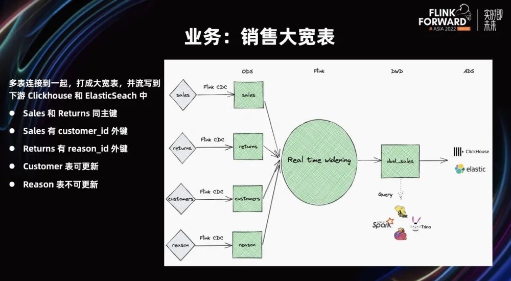

# Paimon生产实践

## Streaming WareHouse的挑战

* 全增量一体摄入。在一个流作业中，全量数据读完之后，无缝切换到增量数据再读，数据和流作业一起进入下一个环节。存储在这里遇到的挑战是，既然有数据全增量一体摄入，说明数据量很大，数据乱序很严重。存储能不能撑住？能不能用高吞吐来支撑全增量一体摄入？
* 消息队列的流读。存储本身作为消息队列需要流写、流读，非常灵活。存储能不能提供全增量一体的流读？能不能指定 timestamp 从历史开始读增量？
* Changelog 的流读。图中的第三部分，Flink 基于 State 的计算严格依赖 Changelog。如果 Changelog 错误，Flink 计算将出现各种各样正确性的问题。当用户输入到存储后，从存储流读的 log 是否准确？变更日志是否完整？这些问题是非常关键。
* 多流 Join 的存储。目前，流计算中 Join 是非常头疼的问题。不光是流计算本身在存储和流计算结合，存储本身也应该在流 Join 上发挥较大的作用。
* 丰富生态的查询。存储跟计算不一样，存储要有比较好的生态。因为不能假设计算能解决一切问题，所以存储需要被各种引擎查询。它必须有一个较好的生态。

## Flink+Paimon的典型场景案例

* 上图存在4张业务表实时流，最终需要根据特定的join key形成一张实时大宽表，**一种方案**是多流Join是把这四张表 Join 一下，然后写到存储当中。但是这种方法的代价非常高，存储会成倍增加，成本非常高。**另一种方案**配合Paimon的"partial-update"的merge-engine，来实现Paimon表的局部更新能力，从而将多流Join的大状态等问题解决；
* 使用Paimon的**partial-update** 的能力，使得相同的两张表同时写到一个大宽表当中，更新各自的字段，互不影响。而且因为配置了 changelog-producer，所以在 Compaction 时会产生正确的宽表日志，下游的流读可以读到最新合并后的数据。

### 相关流表不存在大宽表主键id的问题

* 根据存在主键id的表Lookup Join不存在主键的表的方式来得到一个携带主键id的退货原因表；
* 退货原因表有一个特点是，它的表条数较少，退货表不可更改。所以它比较适合使用 Paimon 作为 Lookup Join 表。进行 Lookup Join，Paimon 会维护一些磁盘 cache。用户不用担心数据量太大，导致 OOM。
* 结合使用 Flink 1.16 Retry Lookup，保证退货表一定能 Join 到 reason 表。即使 reason 表更新较慢，它也能保证 Join 上。通过 Flink Retry Lookup 的方式，成本比较低。