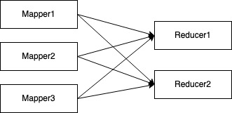
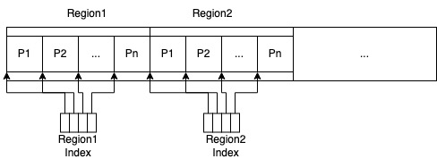

# 概览

* Celeborn是一种Remote Shuffle Service解决方案，支持混合、独立、存算分离方式部署，来提供更加稳定、快速、弹性的Shuffle服务。
* Apache Celeborn 具有两个维度：
  - 第一，引擎无关。官方已经实现了 Spark 和 Flink。后续会进行MR和Tez的集成。
  - 第二，中间数据。这里是指包括 **Shuffle 和 Spill Data**。当我们把中间数据全部托管，它的计算节点就不需要这么大的本地盘了，也就意味着计算节点可以做到真正的无状态，这就可以实现在作业运行的过程中做到更好的伸缩，从而获得更好的弹性和资源使用率。**存算分离**

## 架构

* 在分布式计算引擎中，计算节点之间的数据交换很常见但是开销很大。这个开销来自于传统shuffle框架中的磁盘和网络效率问题（Mapper和Reducer之间的M*N）：



* 除了效率低下外，传统的shuffle框架还需要计算节点中的大量本地存储来存储shuffle数据，从而阻止了存算分离架构的可能。
* celeborn通过以更有效的方式重新组织shuffle数据并把数据存储在单独的服务中来解决上述问题。Celeborn的架构如下：


### 组件

* celeborn有三个主要组件为：Master、Worker、Client
  * Master管理Celeborn集群，基于Raft协议实现高可用(HA)。
  * Worker处理读写请求
  * Client向Celeborn集群写入/读取数据，并管理应用程序的Shuffle元数据。
* 在大多数分布式计算引擎中，通常有两种角色：一种是用于应用程序生命周期管理和任务协调，例如Spark中的`Driver`和Flink中的`JobMaster`；另一种是用于执行任务，例如Spark中的`Executor`和Flink中的`TaskManager`。
* 同样，Celeborn客户端也分为两种角色：LifecycleManager控制页面，负责管理应用程序的所有shuffle元数据；ShuffleClient，数据管理页面，负责从Workers读写数据。LifecycleManager类似于`Driver`或`JobMaster`,每个应用有一个实例，`ShuffleClient`类似于`Executor`或`TaskManager`。

### Shuffle生命周期

Celeborn的shuffle的生命周期如下：

1. Client发送`RegisterShuffle`到Master.Master在Workers之间分配slots，并对Client进行响应。
2. Client发送`ReserveSlots`到Worker，Worker为shuffle留出位置并回应client。
3. Client推送数据到申请的worker.相同partitionId的数据被推送到相同的逻辑分区位置。
4. 在所有Client完成推送数据后，Client向每个Worker发送`CommitFiles`。Worker提交shuffle数据后，然后向Client响应。
5. Client为每个分区split的文件向Worker发送`OpenStream`以准备读取。
6. Client发送`ChunkFetchRequest`到Worker读取chunk
7. 当Client完成数据读取后，会发送`UnregisterShuffle`请求给Master以释放资源。

### 数据重组

* Celeborn通过数据重组提高磁盘和网络效率。通常情况下，Celeborn在逻辑PartitionLocation中存储具有相同partitionId的所有shuffle数据
* 在正常情况下，每个PartitionLocation对应一个文件。当reducer需要分区的数据时，它只需要一个网络连接并顺序地读取粗粒度文件。
* 在异常情况下，例如当文件增长过大或推送数据失败时，Celeborn会生成PartitionLocation的新split数据，并且分区内的未来数据将被推送到新split中。
* LifecycleManager保存分割信息，并告诉reducer从PartitionLocation的所有分割中读取，以保证没有数据丢失。

### 数据存储

* Celeborn支持配置多级存储来存储shuffle数据，例如`Memory`,`Local Disks`,`Distributed File System`和对象存储。用户可以指定配置每个Worker的存储分布。
* 当前Celeborn仅支持`Local Disks`和`HDFS`

## 安装

* 下载Celeborn:https://celeborn.apache.org/download/

## 配置

### 配置环境变量

```shell
mkdir cebeborn-0.3.0
tar -C cebeborn-0.3.0 -zxvf apache-celeborn-0.3.0-incubating-bin.tgz
export $CELEBORN_HOME=/Users/huangshimin/Documents/study/celeborn/cebeborn-0.3.0/apache-celeborn-0.3.0-incubating-bin
```

### 配置日志和存储

* 配置日志

```shell
cd $CELEBORN_HOME/conf
cp log4j2.xml.template log4j2.xml
```

* 配置存储

```shell
cd $CELEBORN_HOME/conf
echo "celeborn.worker.storage.dirs=/Users/huangshimin/Documents/study/celeborn/shuffle" > celeborn-defaults.conf
```

## 启动服务

### 启动Master

```shell
cd $CELEBORN_HOME
./sbin/start-master.sh

# 查看日志找到master节点host:ip
starting org.apache.celeborn.service.deploy.master.Master, logging to /Users/huangshimin/Documents/study/celeborn/cebeborn-0.3.0/apache-celeborn-0.3.0-incubating-bin/logs/celeborn-huangshimin-org.apache.celeborn.service.deploy.master.Master-1-B000000419982B.out
```

### 启动Worker

```shell
cd $CELEBORN_HOME
./sbin/start-worker.sh celeborn://172.21.195.62:9097

# 以下日志表示启动成功
23/08/25 14:42:24,112 INFO [main] MasterClient: connect to master 172.21.195.62:9097.
23/08/25 14:42:24,325 INFO [main] Worker: Register worker successfully.

```

## Spark On Celeborn

### spark-celeborn环境准备

```shell
cp $CELEBORN_HOME/spark/celeborn-client-spark-3-shaded_2.12-0.3.0-incubating.jar $SPARK_HOME/jars
```

### 启动spark shell

* 指定remote shuffle serivce配置

```shell
spark-shell \
--conf spark.shuffle.manager=org.apache.spark.shuffle.celeborn.SparkShuffleManager \
--conf spark.shuffle.service.enabled=false
```

* 模拟Shuffle

```scala
spark.sparkContext
  .parallelize(1 to 10, 10)
  .flatMap(_ => (1 to 100).iterator.map(num => num))
  .repartition(10)
  .count
```

* 观察celeborn master和worker日志

```
# master
23/08/25 15:14:03,735 INFO [dispatcher-event-loop-28] Master: Offer slots successfully for 10 reducers of local-1692947511566-0 on 1 workers.

# worker
23/08/25 15:15:54,378 INFO [worker-forward-message-scheduler] StorageManager: Updated diskInfos:
DiskInfo(maxSlots: 0, committed shuffles 1 shuffleAllocations: Map(), mountPoint: /, usableSpace: 10.6 GiB, avgFlushTime: 0 ns, avgFetchTime: 0 ns, activeSlots: 0) status: HEALTHY dirs /Users/huangshimin/Documents/study/celeborn/shuffle/celeborn-worker/shuffle_data
23/08/25 15:15:55,851 INFO [memory-manager-reporter] MemoryManager: Direct memory usage: 24.0 MiB/1024.0 MiB, disk buffer size: 0.0 B, sort memory size: 0.0 B, read buffer size: 0.0 B
23/08/25 15:16:05,856 INFO [memory-manager-reporter] MemoryManager: Direct memory usage: 24.0 MiB/1024.0 MiB, disk buffer size: 0.0 B, sort memory size: 0.0 B, read buffer size: 0.0 B
```

# Master

Celeborn Master的主要能力如下：

* 管理Celeborn集群的总体状态
* 管理活跃的shuffle
* 保持高可用
* 根据集群状态为每次的shuffle分配slot

## 管理集群状态

启动时，`Worker`会向`Master`注册。之后`Worker`会定期地向`Master`发送心跳，会携带下列信息：

* 在`Worker`上每个磁盘的状态
* 在`Worker`上提供的活跃的Shuffle ID列表

磁盘状态包含以下信息：

* 监控状态
* 可用空间
* 活跃slot
* 上一个时间窗口内的刷新/提取速度

## 管理活跃的Shuffle

* 应用失败是常见的，Celeborn需要一种方法来判断一个应用是否还活着以清理资源。为了实现这个，`LifecycleManager`会定期向Master发送心跳。如果Master发现一个应用的心跳超时，它认为应用已经失败了，即使应用在未来重新发送了心跳。
* Master保留它已经分配槽位的所有shuffle id。在应用程序心跳超时或者接收到UnregisterShuffle时，它会删除相关的shuffle id。在接收到Worker的心跳时，Master会将自己的本地shuffle id与Worker的进行比较，并告诉Worker清理未知的shuffle。
* LifecycleManager的心跳还携带应用程序写入的文件总数和字节数。Master使用最新的指标每10分钟通过Sum（bytes）/ Sum（files）计算估计文件大小。为了抵抗小文件的影响，只考虑大于阈值（默认为8MiB）的文件。

## 高可用

* Celeborn通过**Raft**实现了Master高可用。 实际上，Master在Ratis的多个参与者之间复制集群和shuffle信息。任何状态更改的RPC请求只有在领导者将日志复制到大多数参与者之后才会被ACK。

## Slot申请

* 在接收到`RequestSlots`之后，`Master`为每个分区位置分配一个slot（对）。由于Master维护了所有Worker的所有磁盘的状态，因此它可以利用这些信息来实现更好的负载均衡。
* 当前Celeborn支持俩种分配策略：轮询和负载感知，对于两种策略，Master只会在具有可用磁盘的活跃Workers上分配slot。
* 在分配过程中Master也会模拟空间使用情况。例如，假设一个磁盘的可使用空间为1GiB，每个PartitionLocation的估计文件大小为64MiB，则该磁盘最多只能分配16个槽位。
* Round Robin是一种最简单的分配策略，基本思想是： 
  * 计算每个磁盘可用的可分配槽位 
  * 按照轮询方式在所有Worker和所有磁盘之间分配槽位，分配后减一，如果磁盘或Worker没有可用的槽位则排除 
  * 如果集群的总可用槽位不足，重新运行算法以分配未分配的槽位，就好像每个磁盘都有无限容量
* Load Aware策略的基本思想：
  * 对于异构集群，Workers可能有不同的CPU/磁盘/网络性能，因此有必要基于度量标准分配不同工作负载。 目前，Celeborn基于上次时间窗口中的刷入和获取性能在磁盘上分配槽。如前所述，Worker的心跳中的磁盘状态包含刷入和获取速度。
  * Master基于性能度量标准将所有可用磁盘放入不同组，然后以梯度下降的方式将槽分配到不同组中。 对于每个组，应基于每个磁盘的可使用空间计算应分配多少槽。
  * 例如，将总共四个磁盘分成两个梯度为0.5的组，假设要分配1500个槽，则Master将分配较快的组1000个槽，较慢的组500个槽。假设较快的组中的两个磁盘分别有1GiB和3GiB空间，则它们将被分别分配250个和750个槽。

# Worker

Celeborn Worker的主要功能是：

* 存储、提供和管理PartitionLocation数据
* 通过背压和拥塞控制进行流量控制
* 支持通过Graceful Shutdown实现滚动升级
* 支持弹性`Decommission Shutdown`
* 自我健康检查

Celeborn的Worker有四个专用服务器:

* `Controller`处理控制消息，即ReserveSlots`, `CommitFiles和DestroyWorkerSlots。
* `Push Server`处理主输入数据，即`PushData`和`PushMergedData`，并推送相关控制消息
* `Replicate Server`处理复制输入数据，它与`Push Server`具有相同的逻辑
* `Fetch Server`处理fetch请求，例如`ChunkFetchRequest`和fetch相关控制消息

## 存储

### PartitionLocation物理存储

* 从逻辑上说，`PartitionLocation`包含相同分区id的全部的数据。在物理上，Celeborn将`PartitionLocation`存储在多个文件中，每个文件对应一个`PartitionLocation`对象，该对象具有分区的唯一epoch。具有相同分区id但不同epoch的所有`PartitionLocation`聚合为该分区的完整数据。文件可以在内存、本地磁盘或DFS/OSS中。
* 一个`PartitionLocation`文件只有在提交后才能读取，由CommitFiles RPC触发。

### 文件布局

Celeborn支持俩种类型的分区:

* `ReducePartition`,其中每个`PartitionLocation`文件存储具有相同分区id的部分数据，当前用于Apache Spark。
* `MapPartition`,其中每个`PartitionLocation`文件存储来自相同map id的一部分数据，当前用于Apache Flink。

#### ReducePartition

**ReducePartition**文件布局如下：


* ReducePartition数据文件由几个Chunk组成(默认为8 MiB)。每个数据文件都有一个内存索引，它指向每个Chunk的起始位置。在从某个分区请求数据时，Worker首先返回索引，然后在每个`ChunkFetchRequest`上顺序读取并返回一个Chunk，这是非常高效的。
* 注意，Chunk边界仅由当前块的大小决定。在复制的情况下，由于不能保证数据批处理到达主副本和副本的顺序相同，因此具有相同块索引的Chunk可能在主副本和副本中包含不同的数据。但是，在正常情况下，主文件和副本中的整个文件包含相同的数据。

#### MapPartition

**MapPartition**文件布局如下:



* MapPartition数据文件由几个Region(默认为64MiB)组成，每个Region按分区id排序。每个Region都有一个内存索引，它指向每个分区的起始位置。当从某个分区请求数据时，Worker从每个区域读取分区数据。

## 流量控制

# 部署

## 服务器部署

### 部署celeborn

* 前置环境与概览/安装模块类似

### 修改Master、Worker内存

```shell
vim $CELEBORN_HOME/conf/
cp celeborn-env.sh.template celeborn-env.sh
vim celeborn-env.sh

#!/usr/bin/env bash
CELEBORN_MASTER_MEMORY=4g
CELEBORN_WORKER_MEMORY=2g
CELEBORN_WORKER_OFFHEAP_MEMORY=4g
```

### 修改配置

* 单master集群

```properties
vim celeborn-defaults.conf

# 配置信息
# used by client and worker to connect to master
celeborn.master.endpoints celeborn:9097

# used by master to bootstrap
celeborn.master.host celeborn
celeborn.master.port 9097

celeborn.metrics.enabled true
celeborn.worker.flusher.buffer.size 256k

# If Celeborn workers have local disks and HDFS. Following configs should be added.
# If Celeborn workers have local disks, use following config.
# Disk type is HDD by defaut. 
# celeborn.worker.storage.dirs /mnt/disk1:disktype=SSD,/mnt/disk2:disktype=SSD
celeborn.worker.storage.dirs=/Users/huangshimin/Documents/study/celeborn/shuffle

# 数据存储HDFS
# If Celeborn workers don't have local disks. You can use HDFS.
# Do not set `celeborn.worker.storage.dirs` and use following configs.
celeborn.storage.activeTypes HDFS
celeborn.worker.sortPartition.threads 64
celeborn.worker.commitFiles.timeout 240s
celeborn.worker.commitFiles.threads 128
celeborn.master.slot.assign.policy roundrobin
celeborn.rpc.askTimeout 240s
celeborn.worker.flusher.hdfs.buffer.size 4m
celeborn.worker.storage.hdfs.dir hdfs://<namenode>/celeborn
celeborn.worker.replicate.fastFail.duration 240s

# If your hosts have disk raid or use lvm, set celeborn.worker.monitor.disk.enabled to false
celeborn.worker.monitor.disk.enabled false

```

* ha集群

```properties
# used by client and worker to connect to master
celeborn.master.endpoints clb-1:9097,clb-2:9097,clb-3:9097

# used by master nodes to bootstrap, every node should know the topology of whole cluster, for each node,
# `celeborn.master.ha.node.id` should be unique, and `celeborn.master.ha.node.<id>.host` is required.
celeborn.master.ha.enabled true
celeborn.master.ha.node.id 1
celeborn.master.ha.node.1.host clb-1
celeborn.master.ha.node.1.port 9097
celeborn.master.ha.node.1.ratis.port 9872
celeborn.master.ha.node.2.host clb-2
celeborn.master.ha.node.2.port 9097
celeborn.master.ha.node.2.ratis.port 9872
celeborn.master.ha.node.3.host clb-3
celeborn.master.ha.node.3.port 9097
celeborn.master.ha.node.3.ratis.port 9872
celeborn.master.ha.ratis.raft.server.storage.dir /mnt/disk1/celeborn_ratis/

celeborn.metrics.enabled true
# If you want to use HDFS as shuffle storage, make sure that flush buffer size is at least 4MB or larger.
celeborn.worker.flusher.buffer.size 256k

# If Celeborn workers have local disks and HDFS. Following configs should be added.
# If Celeborn workers have local disks, use following config.
# Disk type is HDD by default.
celeborn.worker.storage.dirs /mnt/disk1:disktype=SSD,/mnt/disk2:disktype=SSD

# If Celeborn workers don't have local disks. You can use HDFS.
# Do not set `celeborn.worker.storage.dirs` and use following configs.
celeborn.storage.activeTypes HDFS
celeborn.worker.sortPartition.threads 64
celeborn.worker.commitFiles.timeout 240s
celeborn.worker.commitFiles.threads 128
celeborn.master.slot.assign.policy roundrobin
celeborn.rpc.askTimeout 240s
celeborn.worker.flusher.hdfs.buffer.size 4m
celeborn.worker.storage.hdfs.dir hdfs://<namenode>/celeborn
celeborn.worker.replicate.fastFail.duration 240s

# If your hosts have disk raid or use lvm, set celeborn.worker.monitor.disk.enabled to false
celeborn.worker.monitor.disk.enabled false

```

* Flink引擎额外配置

```properties
# if you are using Celeborn for flink, these settings will be needed
celeborn.worker.directMemoryRatioForReadBuffer 0.4
celeborn.worker.directMemoryRatioToResume 0.5
# these setting will affect performance. 
# If there is enough off-heap memory you can try to increase read buffers.
# Read buffer max memory usage for a data partition is `taskmanager.memory.segment-size * readBuffersMax`
celeborn.worker.partition.initial.readBuffersMin 512
celeborn.worker.partition.initial.readBuffersMax 1024
celeborn.worker.readBuffer.allocationWait 10ms
```

* 复制配置到celeborn全部节点
* 启动全部服务，如果安装的celeborn分布在所有节点的相同路径并且可以所有节点可以通过ssh连接，可以使用`$CELEBORN_HOME/sbin/start-all.sh`启动全部服务
* 启动成功会在Master日志下打印如下：

```
22/10/08 19:29:11,805 INFO [main] Dispatcher: Dispatcher numThreads: 64
22/10/08 19:29:11,875 INFO [main] TransportClientFactory: mode NIO threads 64
22/10/08 19:29:12,057 INFO [main] Utils: Successfully started service 'MasterSys' on port 9097.
22/10/08 19:29:12,113 INFO [main] Master: Metrics system enabled.
22/10/08 19:29:12,125 INFO [main] HttpServer: master: HttpServer started on port 9098.
22/10/08 19:29:12,126 INFO [main] Master: Master started.
22/10/08 19:29:57,842 INFO [dispatcher-event-loop-19] Master: Registered worker
Host: 192.168.15.140
RpcPort: 37359
PushPort: 38303
FetchPort: 37569
ReplicatePort: 37093
SlotsUsed: 0()
LastHeartbeat: 0
Disks: {/mnt/disk1=DiskInfo(maxSlots: 6679, committed shuffles 0 shuffleAllocations: Map(), mountPoint: /mnt/disk1, usableSpace: 448284381184, avgFlushTime: 0, activeSlots: 0) status: HEALTHY dirs , /mnt/disk3=DiskInfo(maxSlots: 6716, committed shuffles 0 shuffleAllocations: Map(), mountPoint: /mnt/disk3, usableSpace: 450755608576, avgFlushTime: 0, activeSlots: 0) status: HEALTHY dirs , /mnt/disk2=DiskInfo(maxSlots: 6713, committed shuffles 0 shuffleAllocations: Map(), mountPoint: /mnt/disk2, usableSpace: 450532900864, avgFlushTime: 0, activeSlots: 0) status: HEALTHY dirs , /mnt/disk4=DiskInfo(maxSlots: 6712, committed shuffles 0 shuffleAllocations: Map(), mountPoint: /mnt/disk4, usableSpace: 450456805376, avgFlushTime: 0, activeSlots: 0) status: HEALTHY dirs }
WorkerRef: null
```

### 部署Spark客户端

* 复制`$CEBEBORN_HOME/spark/*.jar`相关版本的jar包至`$SPARK_HOME/jars`
* 修改`spark-defaults.conf`配置

```shell
spark.shuffle.manager org.apache.spark.shuffle.celeborn.SparkShuffleManager
# must use kryo serializer because java serializer do not support relocation
spark.serializer org.apache.spark.serializer.KryoSerializer

# celeborn master
spark.celeborn.master.endpoints clb-1:9097,clb-2:9097,clb-3:9097
spark.shuffle.service.enabled false

# options: hash, sort
# Hash shuffle writer use (partition count) * (celeborn.client.push.buffer.max.size) * (spark.executor.cores) memory.
# Sort shuffle writer use less memory than hash shuffle writer, if your shuffle partition count is large, try to use sort hash writer.  
spark.celeborn.client.spark.shuffle.writer hash

# we recommend set spark.celeborn.client.push.replicate.enabled to true to enable server-side data replication
# If you have only one worker, this setting must be false 
# If your Celeborn is using HDFS, it's recommended to set this setting to false
spark.celeborn.client.push.replicate.enabled true

# Support for Spark AQE only tested under Spark 3
# we recommend set localShuffleReader to false to get better performance of Celeborn
spark.sql.adaptive.localShuffleReader.enabled false

# If Celeborn is using HDFS
spark.celeborn.worker.storage.hdfs.dir hdfs://<namenode>/celeborn

# we recommend enabling aqe support to gain better performance
spark.sql.adaptive.enabled true
spark.sql.adaptive.skewJoin.enabled true
```

### 部署Flink客户端

* 复制`$CEBEBORN_HOME/flink/*.jar`相关版本的jar包至`$FLINK_HOME/lib`
* 修改`flink-conf.yaml`配置

```yaml
shuffle-service-factory.class: org.apache.celeborn.plugin.flink.RemoteShuffleServiceFactory
celeborn.master.endpoints: clb-1:9097,clb-2:9097,clb-3:9097

celeborn.client.shuffle.batchHandleReleasePartition.enabled: true
celeborn.client.push.maxReqsInFlight: 128

# network connections between peers
celeborn.data.io.numConnectionsPerPeer: 16
# threads number may vary according to your cluster but do not set to 1
celeborn.data.io.threads: 32
celeborn.client.shuffle.batchHandleCommitPartition.threads: 32
celeborn.rpc.dispatcher.numThreads: 32

# floating buffers may need to change `taskmanager.network.memory.fraction` and `taskmanager.network.memory.max`
taskmanager.network.memory.floating-buffers-per-gate: 4096
taskmanager.network.memory.buffers-per-channel: 0
taskmanager.memory.task.off-heap.size: 512m
```

## Kubernetes部署

* 具体Kubernetes部署查看官方文档：https://celeborn.apache.org/docs/latest/deploy_on_k8s/#5-access-celeborn-service